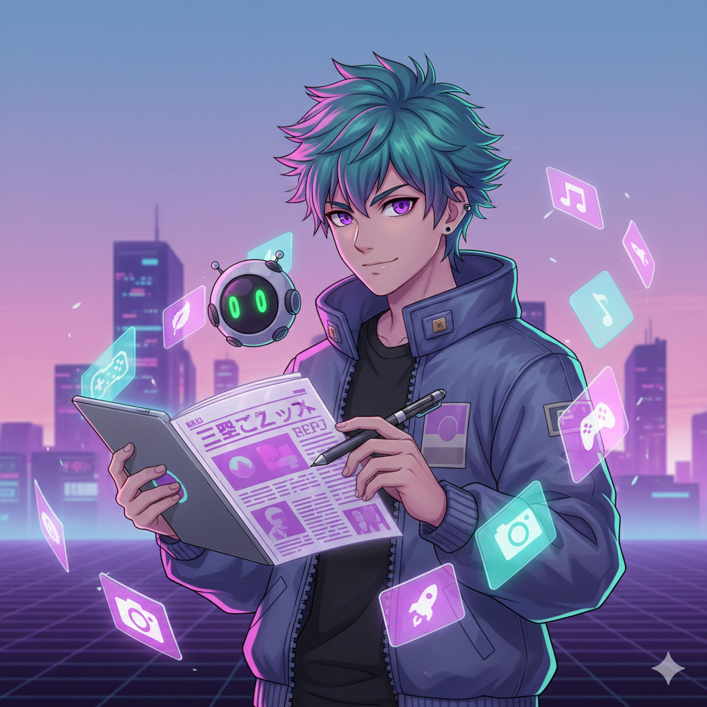

                             Project Overview - Agent GenZPaper

 

 📣 Agent GenZPaper — Multi-Agent Gen-Z Personalized Newspaper

A full-stack AI agent system that converts raw internet news into a Gen-Z friendly, manga-styled digital newspaper.

 🧠 1. Problem Statement

Gen-Z is consuming less traditional news than any previous generation.
Why?

        News is long, boring, and hard to follow
        Too much information → not enough time
        No personalization
        No visuals or simplified explanations
        Feels outdated compared to TikTok/Reels culture

This leads to:

        ⚠️ Low awareness of global events
        ⚠️ Difficulty understanding serious topics
        ⚠️ Misinformation from non-credible sources

GenZPaper solves this by transforming complex news into short, visual, personalized, Gen-Z-friendly digest cards.
 

🚀 2. Why Agents?

Traditional single-model systems fail because:

        Fetching news requires multiple APIs
        Rewriting needs separate language tone abilities
        Selecting images requires vision-based reasoning
        Layout requires high-level editorial planning
        Quality checks need their own logic

A multi-agent architecture lets each part of the pipeline run independently, parallel, and with specialization.

        👉 Each agent does exactly one job.
        👉 Output improves through orchestration.
        👉 The system scales without breaking complexity.

🏗️ 3. System Architecture (High-Level)

🔺 Agent 1 — News Orchestrator (Gemini 1.5 Pro)

        The “brain”.
        Understands user interests → Dispatches tasks → Merges outputs.

🌐 Agent 2 — Parallel Fetcher Agents (Gemini Flash)

  Runs 5 sub-agents simultaneously:

         2A → Google News
         2B → Reddit
         2C → NewsAPI
         2D → YouTube + thumbnails
         2E → RSS feeds

  Outputs sanitized structured JSON.

🎨 Agent 3 — Media Agent (Gemini Flash)

   Finds the best:

         Images
         Thumbnails
         Manga-style visuals (optional)
         Ranks them by relevance.

✍️ Agent 4 — Gen-Z Rewrite Agent (Gemini Flash 2.0)

   Rewrites every article into:

         Gen-Z tone
         Simple English
        “Explain Like I’m 15”
         30-second summaries
         News card format

📰 Agent 5 — Newspaper Builder (Gemini 1.5 Pro)

   Builds the final newspaper:

       Top story
       Trending section
       Quick bites
       Videos
       Manga Mode sections
       Clean formatting
       Creates both Markdown and JSON.

🎭 4.Feature — Manga Mode

GenZPaper supports two layouts:

  🟦 Normal Mode:
      Uses realistic images.

🟪 Manga Mode
   Uses Gemini image generator (banana model) to create anime/manga-style news cards.

         style_mode = "manga" 

  → System switches automatically to illustrated newspaper style.

  This feature massively boosts engagement and originality.

🧩 5. System Workflow

      User selects interests →
      Agent 1 triggers parallel fetchers →
      Agent 2A–2E return structured news →
      Agent 3 selects images and optional manga illustrations →
      Agent 4 rewrites everything in Gen-Z tone →
      Agent 5 assembles the final newspaper →
      Output exported (Markdown + JSON)

   

🛠️ 7. Tools & Technologies

     Gemini 1.5 Pro → Orchestration + layout
     Gemini Flash / Flash 2.0 → Fetching + rewriting + media
     Gemini Image Generation (banana) → Manga-style thumbnails
     Google ADK → Agent framework
     Python → Full backend
     Markdown + JSON outputs

🏗️ 10. How I Built It

     Started with user research → identified Gen-Z patterns
     Designed multi-agent architecture
     Implemented fetchers (Agent2A–2E)
     Created rewriting logic with quality checks
     Added manga-style generator
     Built newspaper layout engine
     Added tests for robustness
     Packaged everything into a reproducible repo

🔮 11. If I Had More Time…

     Add voice-based news reader agent
     Add personalization reinforcement learning
     Use embeddings for topic clustering

🧡 12. Final Statement

Agent GenZPaper is built to solve a real-world problem:
making credible news accessible, visual, and fun for the next generation.

It uses agents not as a buzzword, but as a true architectural advantage.
 

