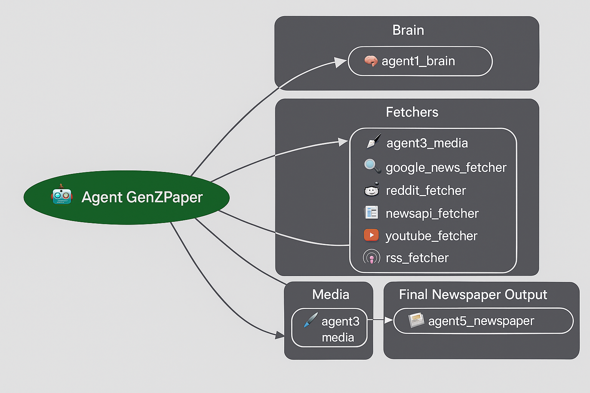

                                                 Project Overview - Agent GenZPaper

  ## 🧩 System Flow Diagram

Agent GenZPaper is a multi-agent news intelligence system designed to generate personalized Gen-Z friendly news digests.It automatically gathers trending news, rewrites them in simple and relatable tone, attaches the best media, and assembles everything into a clean modern “Gen-Z style newspaper”.The system is built using Google’s Agent Development Kit (ADK) and follows a modular, scalable agent architecture.

 
 🧩 Problem Statement

Gen-Z increasingly avoids traditional news sources. Long articles, cluttered interfaces, and boring tone reduce attention span and engagement.
Users prefer:

            Short summaries
            Simple explanations
            Visual media
            Casual tone
            Curated topics only
            Daily digest formats
However, manually searching for news, filtering high-quality sources, summarizing, rewriting, and arranging articles is extremely time-consuming.

   
   💡Solution Statement

Agent GenZPaper solves this by using multiple specialized AI agents that:

✔ Collect news from multiple sources
(Google News, Reddit, RSS, NewsAPI, YouTube)

✔ Rewrite content into Gen-Z tone
Explain-like-I’m-15 (ELI15), emoji-friendly, concise 30-sec summaries.

✔ Select high-quality supporting media
Images, thumbnails, visuals.

✔ Assemble a personalized newspaper
Arranged by priority, topics, and user preferences.

The result is a fully automated pipeline that produces fresh news, rewritten for Gen-Z, with visuals, curated in seconds.

 
   
   🏗️ Architecture

At the core of Agent GenZPaper is the News Orchestrator — a multi-agent system coordinating all news, rewriting, and media tasks.This is not a single model but a team of specialized agents, each responsible for a different part of the news pipeline.The architecture uses Google ADK’s Agent class, which allows chaining, delegating, validation, and iterative refinement.

🔺 Core Agents Overview

🧠 Agent 1: News Orchestrator (Gemini 1.5 Pro)

The “brain” of the entire system.It understands the user’s interests, assigns tasks to sub-agents, merges all outputs, and ensures quality.

🌐 Agent 2: Multi-Source News Fetchers (Gemini Flash)

A collection of parallel agents:

Agent 2A – Google News
Agent 2B – Reddit
Agent 2C – NewsAPI
Agent 2D – YouTube news + thumbnails
Agent 2E – RSS feeds

Each fetcher collects structured JSON and performs light cleanup.

🎨 Agent 3: Media Agent (Gemini Flash)

Finds, ranks, and selects images, thumbnails, and visuals that best support the stories.

✍️ Agent 4: Gen-Z Rewriter (Gemini Flash 2.0)

Transforms monotone news into:
Gen-Z tone
Simple English
ELI15 explanation
30-second summaries
Digest cards
Consistent formatting

📰 Agent 5: Newspaper Builder (Gemini 1.5 Pro)

Merges rewritten text + visuals into a structured newspaper layout.
Decides priorities, section order, spacing, and card formatting.
This is the final assembler and quality controller.

 
   
   🛠️ Tools & Utilities

The agents use custom-built tools to operate effectively.

News Fetching Tools
google_news_fetcher
reddit_fetcher
rss_fetcher
newsapi_fetcher
youtube_scraper
Each returns normalized structured JSON.
Media Tools
image_finder
thumbnail_selector
Formatting Tools
card_builder
newspaper_layout_engine
File Saving
save_digest_to_markdown
save_digest_to_json

   
   
   🔍 Validation Checkers

GenZPaper uses custom Validation Agents to ensure correctness:

NewsQualityChecker – Ensures no empty stories.
RewriteQualityChecker – Ensures content follows Gen-Z tone.
LayoutValidationChecker – Ensures final layout is readable and complete.
LoopAgents retry on validation failure, allowing high reliability.

   🧠 Workflow

## 🧠 Agent Brain Visual

The interactive news pipeline follows these steps:

User Input
User selects interested topics (e.g., tech, sports, finance, pop culture).

Multi-Source Fetching
Agent 1 triggers:

Agent2A, 2B, 2C, 2D, 2E

Media Gathering
Agent 3 finds best media for top stories.

Gen-Z Rewrite
Agent 4 rewrites and formats all stories.

Layout & Assembly
Agent 5 builds the final newspaper with priority ordering.

Export
Output saved as:

Markdown newspaper

JSON API response

PDF (optional extension)
